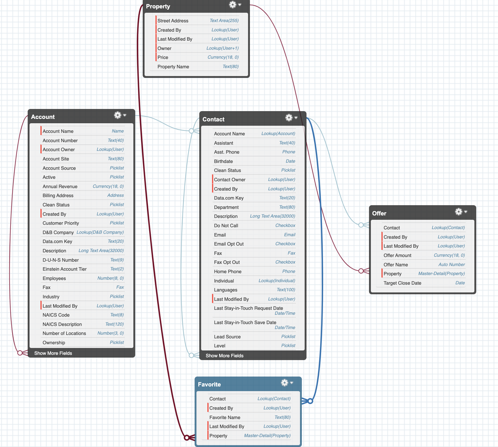

# Data Modeling

---

There are standard objects, custom objects, external objects, platform events, and BigObjects, but mainly we will focus on standard and custom objects.

1. Standard: It is provided by Salesforce like Accounts, Contact, Lead, etc.
2. Custom: It is defined by you according to business requirements.

> Objects are containers for your information, Salesforce provides some functionality with it like page layout for the user interface.

**Object:**

* Think of it like an object of a Class(not the wholesome).
* It consists of different Fields.
* When you want to see objects in Tab, you need to add them in the Tab section.

e.g: **Property** is an **Object** which has a Name, Address, Offer and Price as a **Field**

**Fields**

* Attribute of an object like a Name, etc.
* Field has Singular and Plural Name.
* Custom Field API_name end with `__c`to denote it as a custom field.

### Object Relationship

1. Lookup Relationships

	* Relationships between 2 Objects.
	* Relationships can be one-to-one or one-to-many.

2. Master-Detail Relationships

	* It is like a parent who has control over their child, who can take care(view) the child.
	* e.g: A Owner wants to give/delete an offer on his property so, you can see here Property is a Parent and Offers is its children. In this scenario, If the owner deletes the property, the offer will also get deleted.

3. Hierarchical Relationships

	* A special type of lookup relationship.
	* It is only available for User Object.
	* You can use them for things like creating management chains between users.

>  Objects in lookup relationships usually work as stand-alone objects but in the master-detail relationship, the detail object doesn’t work as a stand-alone, It is completely dependent on the Master.

### Schema Builder

1. It provides you visual of your object i.e Table of database
2. You can create an Object here directly
3. You can add fields in an Object 
4. You can create relationships also

