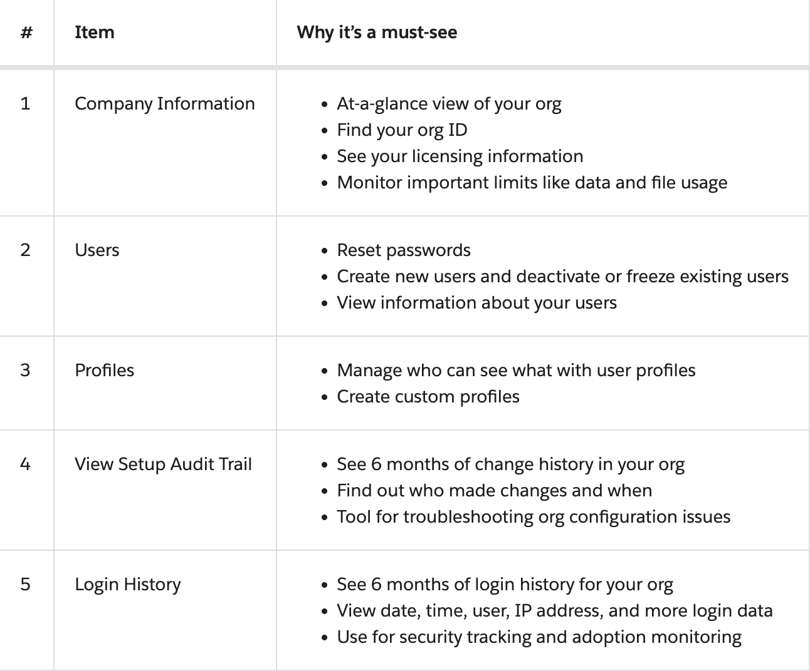

# Salesforce Admin

### Salesforce Platform Basic

---
Salesforce is not just a CRM, It provides you with a lot of features and functionality to run your company, Lead for your business, after-sales support, customizable mobile apps,  collaborator tools like slack, chatter and so on, Marketing cloud, etc.

* Cloud Services for different types of Businesses
* Customizable 
* Support of Collaborators 
* Salesforce comes with standard functionality for tracking common sales objects like accounts, contacts, and leads
* You can also track other things related to your business

**Technical / Functional Understanding**

1. App: Salesforce is a set of **objects**, **fields**, and other functionality that supports a business process
2. Objects: **Tables** in the Salesforce database. e.g Accounts, Contact and custom Objects
3. Records: **Rows**(actual data) in object database tables.  
4. Fields: **Columns**(attribute) in object database tables

**Hands On Trailhead Playground**

1. Always give the right name to your playground.
2. Reset the password for the user
3. To Install the package, Either Install with package ID or open the package link in a private window and log in with the correct user concerning org.

> If you make any changes in an ORG, It will make an impact on every app related to it.
> Like you created an object in an org, it will available for all apps.

### Setup
---

1. Object Manager: Object Manager is where you can view and customize standard and custom objects in your org.
2. Setup Menu: The menu gives you quick links to a collection of pages that let you manage your users and modify security settings.
3. Main Window: We’re showing you the Setup home page, but this is where you can see whatever it is you’re trying to work on.

**Setup Menu**

1. Administration: The Administration category is where you manage your users and data. You can do things like add users, change permissions, import and export data, and create email templates.
2. Platform Tools: You do most of your customization in Platform Tools. You can view and manage your data model, create apps, modify the user interface, and deploy new features to your users. If you decide to try your hand at programmatic development, Platform Tools is where you also manage your code.
3. Settings: Finally, Settings is where you manage your company information and org security. You can do things like add business hours, change your locale, and view your org’s history.

